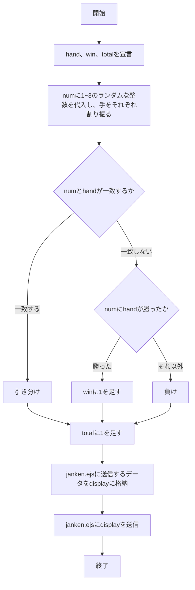
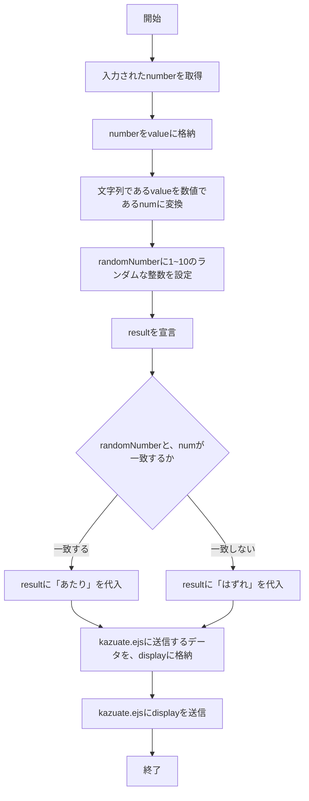
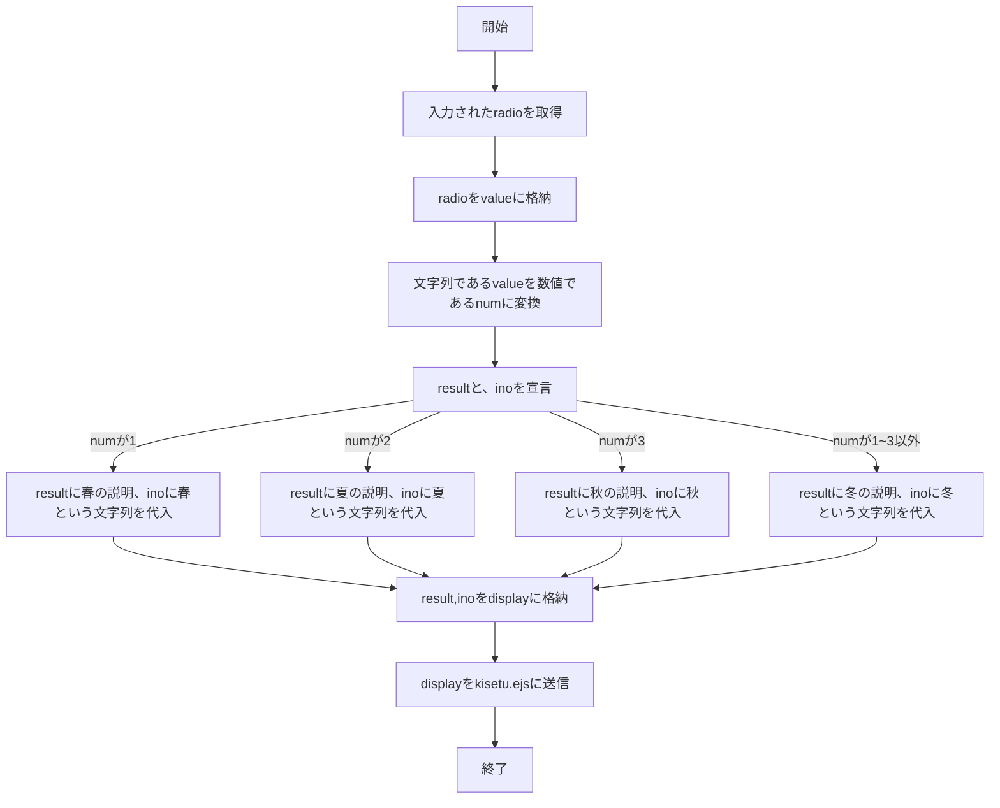

# webpro_06のレポート

## 各機能の使用方法

1. ターミナルでapp5.jsが格納されているディレクトリーまで移動する
1. ```node app5.js``` を起動する
1. 新規ウィンドウでターミナルを開き、そこに```telnet localhost 8080```を打ちこむ
1. Webブラウザでlocalhost:8080/public/hoge.htmlにアクセス
(hogeは使いたいそれぞれの機能の名前を入力する)
1. 各機能で入力可能な箇所を、入力する

## 各機能の説明
### hello1
"Hello"と，"Bon jour"を表示する
### hello2
"Hello"と，"Bon jour"を表示する
### icon
あらかじめ指定された画像を表示する
### luck
動作を開始すると，ランダムに6つの運勢から一つを選んで，今日の運勢として表示する
### janken
グー，チョキ，パーのうち一つを選んで入力すると，じゃんけんができる
### kazuate
1~10の整数のうち一つを選んで入力すると，それが当たってるかどうかでゲームができる
### kisetu
4つの季節を選ぶと，その季節の説明を表示する

## 各機能の内部処理
### 初期設定
1. サーバーアプリケーションを立ち上げる
1. ejsファイルを使用することを宣言
1. publicファイルを使用できるようにする

### hello1
1. message1に"Hello"、message2に"Bon jour"を設定する
1. greet1と、greet2にそれぞれmessage1、message2を格納する
1. greet1と、greet2をshow.ejsファイルに送信する

### hello2
1. greet1と、greet2にそれぞれ直接"Hello"、"Bon jour"を設定する
1. greet1と、greet2をshow.ejsファイルに送信する

### icon
icon.ejsファイルに、filenameと、画像が表示されなかったときに、代わりとして表示されるalt属性のデータを送信する

### luck
1. numに1~6のランダムな整数を格納する
1. numの1~6に、それぞれの運勢(luck)を振り分ける
1. 運勢の結果を表示する
1. luck.ejsに、numと、luckのデータを送信する

### janken


### kazuate


### kisetu


2024/11/16